# The Bouncer

**A moderation wall that knows what it doesn't know.**

Real comments stream toward a gate. TypeSafe's **Jev** — a non-generative
decision model — scores each one on four axes in flight, and they land in one
of three lanes: **Approved**, **Bounced**, or **the Pen**, where a human
decides.

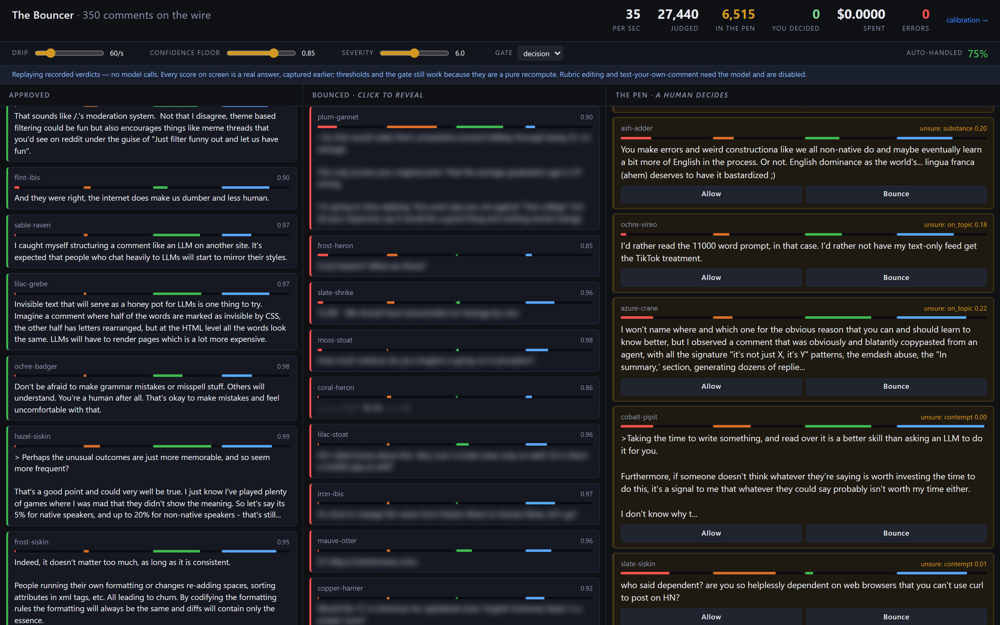

*Real Hacker News and r/changemyview comments at 60/s. Green is approved, red
is bounced and blurred, amber is the Pen. Every score on screen came from the
model — the spend counter reads $0.0000 because this is the offline replay,
which is the same wall for nothing.*

---

## The problem this is about

Every platform with a comment box ends up running the same queue. Volume is far
too high for humans, so a classifier sits in front of it. And every classifier
conversation stalls in the same place:

> *"Your model is wrong about 15% of the time. Which 15%?"*

Nobody can answer that, so the queue gets built one of two bad ways. Either you
set the threshold conservatively and bury your moderators in false positives, or
you set it loosely and find out from Twitter which comments you got wrong.

**Jev answers that question directly.** It returns a calibrated confidence with
every judgment, and that confidence predicts whether the judgment is right. So
instead of one threshold on *severity*, you get a second axis — *certainty* —
and a queue that routes its own hard cases to a person.

|  | Confident | Low confidence |
|---|---|---|
| **Over the line** | Bounced 🔴 | **The Pen** 🟠 |
| **Fine** | Approved 🟢 | **The Pen** 🟠 |

Amber does not mean "mildly toxic". It means *the model doesn't know, so a
human decides*.

### The objection, and the answer

Someone in the room will point out that Jev is not always more accurate than a
small LLM. On at least one public benchmark it is materially worse than Claude
Haiku. That objection is correct and the demo is built so the answer is already
on screen:

> The claim is not "this model is right."
> The claim is **"this model knows when it isn't, and escalates."**

## The proof

Not an assertion — a curve, on a second tab, from 300 human-labelled Civil
Comments the model has never been tuned against.

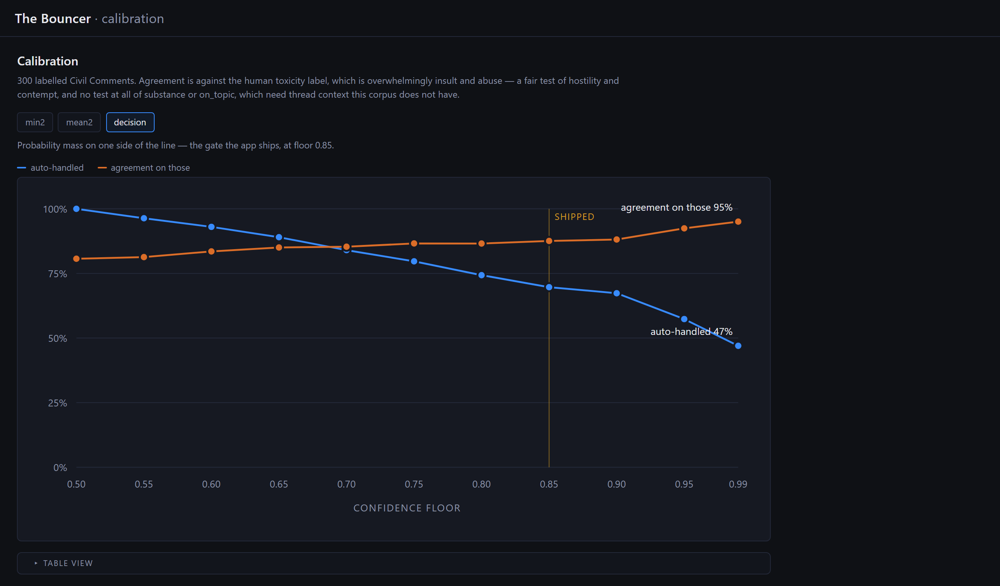

Raise the confidence floor and you auto-handle less but agree with the human
label more. Every point is measured:

| confidence floor | auto-handled | agreement on those |
|---|---|---|
| 0.50 (escalate nothing) | 100% | 0.807 |
| 0.70 | 84% | 0.853 |
| **0.85 — shipped** | **70%** | **0.876** |
| 0.95 | 57% | 0.924 |
| 0.99 | 47% | 0.950 |

**Monotonic, which is the whole ballgame.** If confidence were noise this line
would be flat and the Pen would be decoration. Instead, escalating the least
certain 30% buys nearly seven points of agreement on everything you keep — and
you can pick any other operating point on that curve by dragging a slider.

The caveat is printed above the chart in the app, too: the human label here is
overwhelmingly insult and abuse, so this tests `hostility` and `contempt` and
says nothing about `substance` or `on_topic`, which need thread context this
corpus does not have.

---

## What you are looking at

### Every card carries its own fingerprint

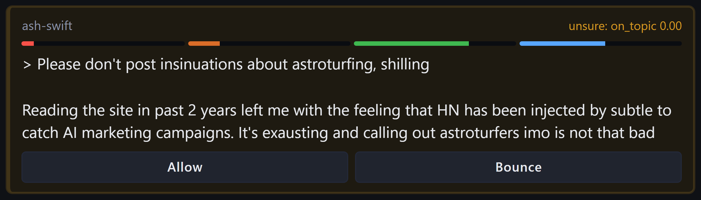

Four bars — `hostility`, `contempt`, `substance`, `on_topic` — scored 0–10, and
on a penned card, the axis the model was least sure about. Four **Score**
questions go out per comment against one shared state; Jev evaluates them
independently and in parallel, so the fourth costs tokens but almost no time.

Scores rather than yes/no, because a yes/no piles up at the extremes. A
distribution spreads, gives you a usable threshold surface, and reads as a
silhouette from across a room.

### The Pen is the point

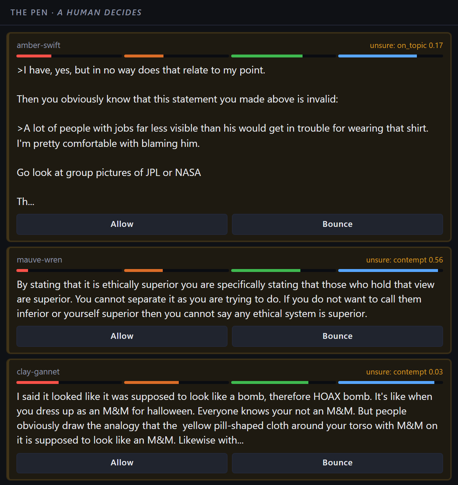

Read those three. The first is an argument about who deserves blame for a
shirt; the second is a philosophical point about ethical superiority that
*sounds* contemptuous; the third is about whether a costume looks like a bomb.
Every one of them is arguable either way, and the model said so rather than
guessing.

**This is the test the demo has to pass.** If a viewer clicks into the Pen and
finds obvious cases, the threshold is wrong. If they hesitate, it is working.

### Bounced is blurred until you ask

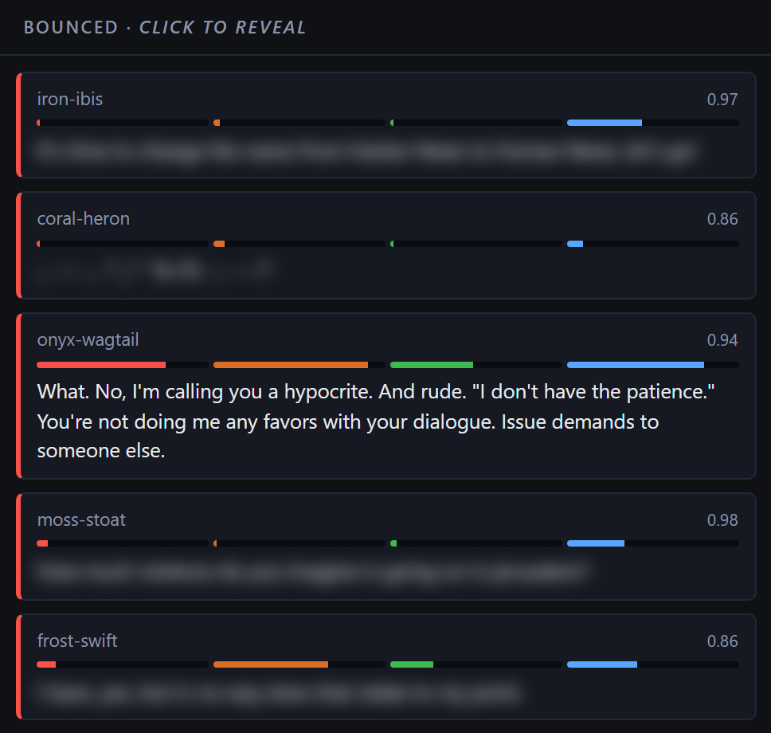

Click to reveal. Real moderation tools do this, and the demo goes on a screen in
an office. The revealed card is the one with the long red bar, at 0.94
confidence — hostile, and the model is sure.

### Retuning the whole wall is free

This is the best thing in here. Drag the confidence floor and every card
re-sorts:

| floor 0.99 — cautious | floor 0.55 — permissive |
|---|---|
| 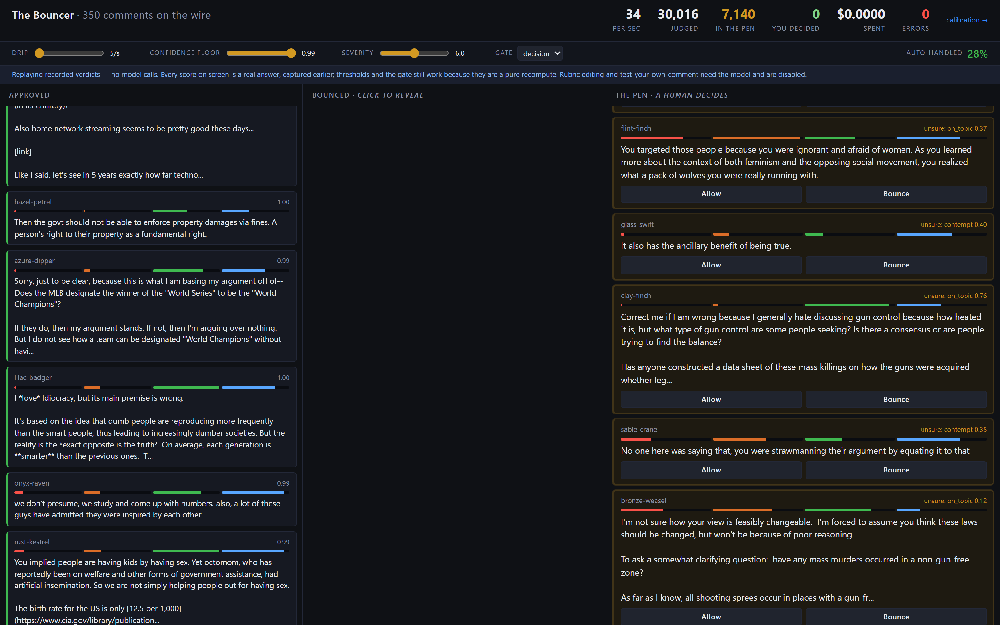 | 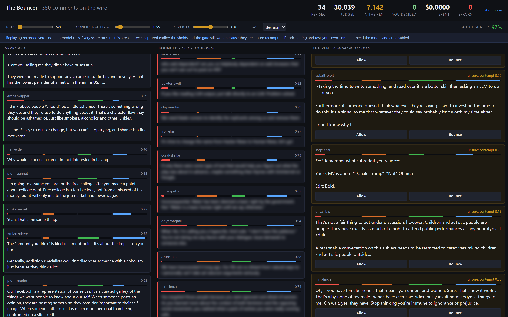 |
| auto-handled **28%**, Bounced lane empty | auto-handled **97%**, Bounced lane full |

**And the spend counter does not move.** Every verdict already carries four
scores and four probability distributions, so a new threshold is a pure
recompute in Python — no model calls. A viewer drags the floor, watches the Pen
fill and drain, and reads the trade off the screen instead of being told a
percentage.

It also works in offline mode, which means you can demo the single most
persuasive control in the product with no API key at all.

### Type your own comment

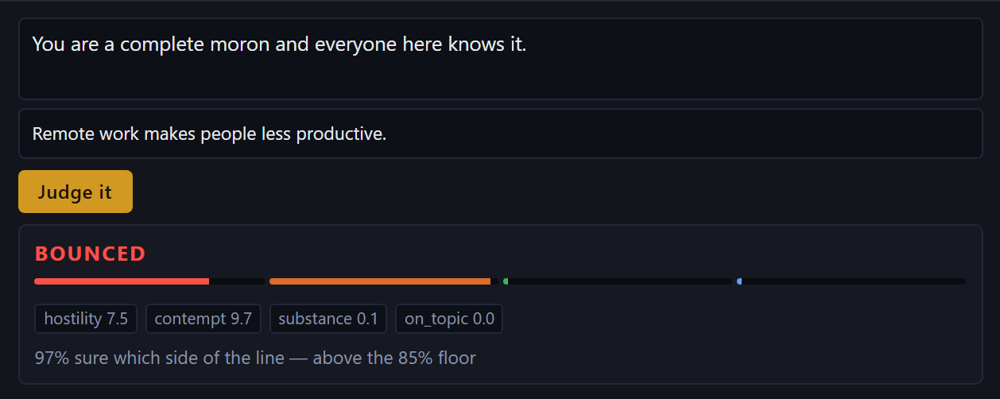

The shareable artifact — people screenshot their own comment getting bounced.
One real model call, about $0.000034.

The "replying to…" field is not decoration: `on_topic` is scored against
whatever the comment answers, and leaving it blank drags confidence down for
reasons that have nothing to do with what you typed.

### Edit the rubric, re-judge the backlog

This is the answer to *"why wouldn't you just train a classifier?"* An axis is
not a set of weights — it is a question and five ordered sentences, editable in
the browser.

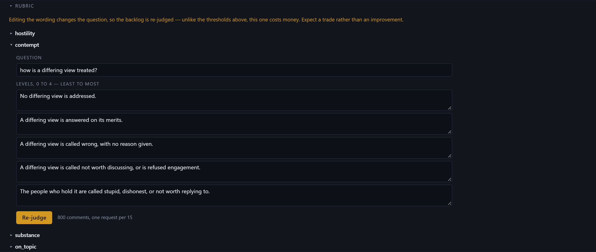

Change one, press **Re-judge**, and the whole retained backlog goes back through
the model:

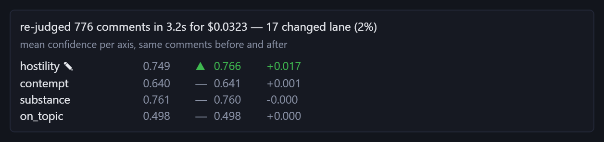

**776 comments, 3.2 seconds, 3.2 cents.** A trained classifier needs a
labelling run and a retrain. This needed a sentence.

Note what the report shows: *every* axis, not just the one you edited. A rubric
change is a trade, and during this build an edit that removed a documented
defect made its axis measurably **worse**. "Watch it improve" would be the
dishonest version of this feature.

---

## Run it

Requires [uv](https://docs.astral.sh/uv/). Python 3.12 is pinned in
`.python-version`; `uv sync` fetches it if you don't have it.

```bash
uv sync
```

### No key, no spend — start here

```bash
uv run python -m web.app --offline
```

Open <http://127.0.0.1:5001>. This replays 350 recorded verdicts. Every score on
screen is a real answer the model gave, captured earlier — and the lane policy,
the confidence gate, the threshold sliders and Allow/Bounce are all the genuine
article, because they are a pure recompute over stored probabilities. Only two
features need a live model, and they refuse rather than return stale numbers.

**[`TESTING.md`](TESTING.md) is a hand-testing guide** — three tiers, eight
numbered exercises on the offline wall, each stating what to expect and what it
proves. Nothing there needs to be left streaming.

### Live

```bash
cp .env.example .env     # then fill in TYPESAFE_API_KEY
uv run --env-file .env python -m web.app
```

`.env` is gitignored. The SDK reads `TYPESAFE_API_KEY` from the environment
itself — it is never passed in code, never inlined, never committed.

### Read this before leaving it running


Both of these are true and they tell opposite stories:

| | |
|---|---|
| per 1,000 comments | **$0.034** |
| **per minute of streaming** | **$0.41** |
| per hour | $24.80 |
| an 8-hour conference day | **$198** |

The unit price is trivial. The per-minute price governs actually running the
thing, and it emptied the account twice before anyone multiplied it out. The
**drip slider is the cost dial** and it is already in the UI — 20/s still reads
as a stream and costs a tenth as much. The pipeline also only judges while a
browser is attached.

> **Check for orphans after any live run.** Ctrl-C and closing the terminal do
> not always kill the `uv run` child, and a stray one keeps judging at full
> rate for nobody. Eight of them is what burned the credits.
>
> ```bash
> lsof -i :5001 && pkill -f "python -m web.app"      # macOS / Linux
> ```
>
> ```powershell
> Get-NetTCPConnection -LocalPort 5001 -State Listen -ErrorAction SilentlyContinue |
>   ForEach-Object { Stop-Process -Id $_.OwningProcess -Force }   # Windows
> ```
>
> If Windows answers **Access is denied**, the server was launched by an IDE or
> coding agent that owns the process and your own shell cannot end it — use an
> elevated PowerShell. [`TESTING.md`](TESTING.md) has the longer version.

### Everything else

```bash
uv run pytest                          # 128 tests, no network, no key
uv run ruff check --fix .              # lint
uv run python -m calibrate.sweep       # the threshold + gate curve (offline)
uv run python -m feed.hn_fetch --search   # dev-time: find and fetch a thread
uv run python -m feed.bake             # dev-time: refresh the offline recording
```

---

## How it works

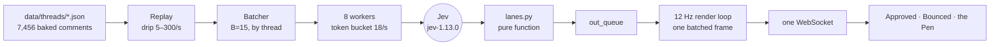

Four Score questions per comment, batched fifteen to a request, addressed by
quoting the comment into its own question rather than by index. Lanes are
computed in Python from the scores **plus** confidence as two separate axes —
confidence is never an option the model picks, because putting "not sure" into
a Choice corrupts exactly the thing being demonstrated.

Workers never push to the socket. They write to a queue that a separate loop
drains on a fixed 12 Hz tick and emits as one frame; coupling them gives you
hundreds of DOM swaps a second and a dead page. The DOM is capped at 150 cards
per lane with tail eviction.

FastHTML and HTMX over one WebSocket, inline SVG, no build step, no React, and
no second model anywhere — adding an LLM to a Jev demo would defeat the demo.

| Path | Responsibility |
|---|---|
| `config.py` | Every tunable constant. No magic numbers elsewhere |
| `feed/` | Replay reader, anonymisation, dev-time fetch and bake |
| `judge/` | Batcher, Jev client, rubric, lane classification, offline client |
| `web/` | Routes, WebSocket, the 12 Hz render loop, rate limits |
| `calibrate/` | Jigsaw threshold sweep and the committed curve |
| `experiments/` | The measurement scripts behind `FINDINGS.md` |
| `data/threads/` | Pre-baked JSON. Nothing is fetched at runtime |

### The data

| comments | source | thread |
|---|---|---|
| 3,636 | Hacker News | CrowdStrike Update: Windows Bluescreen and Boot Loops |
| 1,562 | Hacker News | Don't post generated/AI-edited comments |
| 1,392 | Hacker News | YouTube-dl has received a DMCA takedown from RIAA |
| 866 | r/changemyview (ConvoKit) | 120 conversations that turned hostile |

Usernames are hashed at fetch time and `u/` mentions are scrubbed from the
bodies — real handles never enter the data files or the UI. Nothing is fetched
while the app is running.

---

## What measurement changed

**[`FINDINGS.md`](FINDINGS.md) is the deliverable as much as the app is.** This
is a capability measurement, not a sales demo: the object was to find out how
far this paradigm carries a real problem, and a limitation found and
characterised counts as a result.

Three of the technical spec's load-bearing assumptions turned out to be wrong.

- **The batch-size knee does not exist** (§1). Accuracy is flat from B=1 to
  B=30; B=30 was the best run. The spec called this the project's main risk and
  said to build no UI until it was settled. It was a non-issue — but the
  noise-floor control the experiment forced into the method caught a real 6–7%
  lane wobble that would otherwise have read as nothing.
- **You are token-limited, not request-limited** (§16). A request is ~12,000
  tokens, not the 2,400 the spec assumed, because every question restates the
  whole rubric. Both ceilings bind near 300 items/sec, so raising the batch size
  buys nothing. **93% of every request is overhead**, and it is structural.
- **More concurrency is actively harmful** (§16). 24 workers gained 9%
  throughput and multiplied rate-limit errors fifteenfold. That matters more
  than it sounds: a failed request pens fifteen comments by design, so the Pen
  quietly went from 14% to 22% where the extra was *failures*. A Pen full of
  errors is indistinguishable from a Pen full of hard cases and is worthless.

And two that reshaped the product:

- **The rubric was the real constraint, not the model** (§11). Confidence on a
  Score *is* the concentration of probability across levels, so two levels that
  could describe the same comment split the probability and look exactly like a
  hard comment. A badly written rubric is indistinguishable from a hard corpus.
  Rewriting levels as one unambiguous ordering moved `hostility` confidence by
  0.114 — more than any pipeline change.
- **The confidence gate was measuring the wrong quantity** (§13). `min()` over
  four axes penned 99% of traffic — arithmetic, not caution. And the scalar
  confidence answers "which level?", while the lane turns on "which side of the
  line?". Switching to probability mass on one side took the Pen from 84% to
  20%. It is **not more accurate** — same curve, correlation 0.845 — but the
  number now means the thing the lane turns on, so the floor reads in plain
  English.

## Where it doesn't work

Two things a reader should know up front, both written up rather than tuned
away.

**`contempt` has a confidence floor near 0.66 that three rewrites could not
move.** Two of those rewrites were designed specifically to fix it; the three
variants span 0.034 against `hostility`'s 0.114. With `hostility` at 0.675 it
is one of the two axes that send most of the Pen's traffic. The visible
consequence: type *"Anyone who still believes this is beyond help. Not worth
explaining again."* into the tester and it scores `contempt` 9.2/10
and **still pens**, because the gate is only 79% sure. High score, low
confidence, routed to a human — correct behaviour, and worth explaining rather
than reloading until it bounces.

**The Bounced lane is 3–4%, and that is the data, not the pipeline.** Across 200
ChangeMyView comments — a corpus *curated for conversations that derail into
personal attacks* — `hostility` has median 1.2 and a maximum of 7.4. Nothing
reaches the rubric's top rung. That is what real discussion forums look like:
most comments are fine, a meaningful slice is genuinely borderline, unambiguous
abuse is rare. Lowering the severity threshold would fill the red lane, but it
would change what the demo claims moderation *means*; sourcing harsher data
would be staging it. Both were considered and refused.

Also true, and smaller: batching flips 6–7% of lane decisions against a
near-deterministic baseline, which is fine for a stream and not fine for
anything that must give the same comment the same verdict twice. And Jev is a
decision model, not a knowledge store — no fact-checking, no arithmetic, no
counting, by design.

## Measured

| | |
|---|---|
| corpus | 7,456 pre-baked comments, 4 threads |
| throughput | **225 items/sec** sustained (target was 200) |
| latency | p50 285 ms, p95 1,291 ms |
| lanes | ~73% Approved · ~4% Bounced · ~23% Pen — moves with the corpus |
| cost | $0.034 per 1,000 comments — **and $0.41 per minute of streaming** |
| calibration | agreement 0.807 → 0.950 as the floor rises; monotonic |
| re-judge | 776 comments re-scored in 3.2 s for $0.032 |
| tests | 128, none of which need network or a key |

## The rest of the documentation

| | |
|---|---|
| [`TESTING.md`](TESTING.md) | **Hand-testing guide.** Discrete checks; most need no key |
| [`DEMO.md`](DEMO.md) | **The runbook.** Read before showing it to anyone |
| [`FINDINGS.md`](FINDINGS.md) | **What measurement changed.** Supersedes parts of the two below |
| [`PRD.md`](PRD.md) | Product logic, especially §5 — the two-axis model |
| [`TECHNICAL_SPEC.md`](TECHNICAL_SPEC.md) | Architecture, Jev integration, build order |
| [`TASKS.md`](TASKS.md) | The plan and current progress |
| [`CLAUDE.md`](CLAUDE.md) | The rule set, including the hard invariants |
